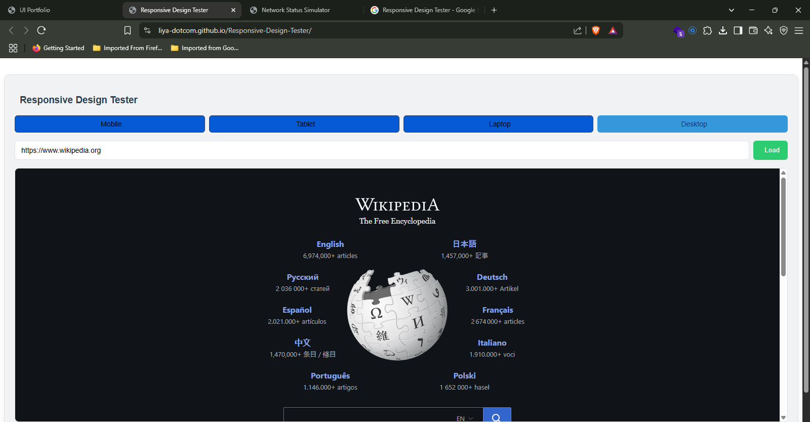
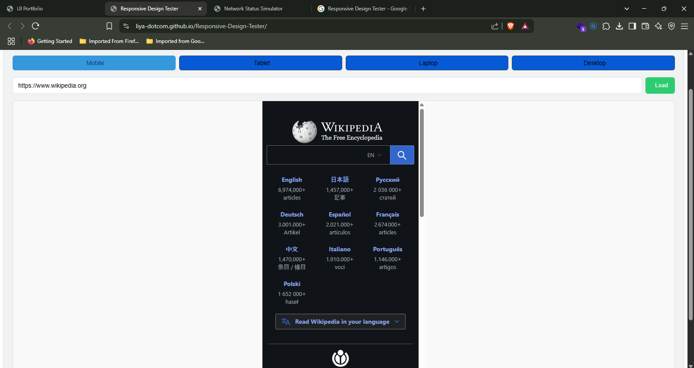

Here’s a simple and well-structured README template for a student project:

```markdown
# Responsive Design Tester

A web-based tool to test responsive designs across various screen sizes and devices.

## Table of Contents
- [Overview](#overview)
- [Features](#features)
- [Technologies Used](#technologies-used)
- [Setup Instructions](#setup-instructions)
- [Usage](#usage)
- [Screenshots](#screenshots)
- [Future Improvements](#future-improvements)
- Contributors
- [License](#license)

---

## Overview
The **Responsive Design Tester** allows developers to preview how their websites look on different devices and screen sizes. It provides an easy way to test responsiveness without needing physical devices.

---

## Features
- Test websites on predefined device sizes (e.g., mobile, tablet, desktop).
- Custom URL input for live testing.
- Interactive buttons to switch between device views.
- Responsive and user-friendly interface.

---

## Technologies Used
- **HTML5**: Structure of the application.
- **CSS3**: Styling and responsive design.
- **JavaScript**: Interactivity and dynamic behavior.

---

## Setup Instructions
1. Clone the repository:
   ```bash
   https://github.com/Liya-dotcom/Responsive-Design-Tester.git
   ```
2. Navigate to the project directory:
   ```bash
   cd responsive-design-tester
   ```
3. Open the `index.html` file in your browser to start using the tool.

---

## Usage
1. Enter the URL of the website you want to test in the input field.
2. Use the device buttons to switch between different screen sizes.
3. Observe how the website adapts to each screen size.

---

## Screenshots
### Desktop View


### Mobile View


---

## Future Improvements
- Add more device presets.
- Allow users to define custom screen sizes.
- Include dark mode for the interface.
- Add a feature to save screenshots of the preview.

---

## License
This project is licensed under the MIT License. See the [LICENSE](LICENSE) file for details.

## Contributors
- Liyabona Thebe
```
This README provides a clear overview of the project, its features, and how to use it. You can customize it further based on your specific project details.
